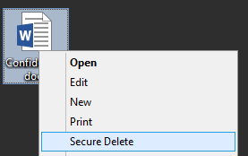

SDelete Gui 
===========

###Securely delete files with an easy to use right click option

##[Download now](https://github.com/Tulpep/SDelete-Gui/releases/latest)

A very simple utility that adds a new option to the Windows context menu (right click menu) to securely delete files and folders, using a United States Department of Defense compliant algorithm. This process will completely delete the item and it can never be recovered again.

This tool only adds the right menu option, it uses [SDelete](http://technet.microsoft.com/en-us/sysinternals/bb897443.aspx) of [Microsoft Sysinternals](http://technet.microsoft.com/en-us/sysinternals/bb545021.aspx) written by [Mark Russinovich](http://blogs.technet.com/b/markrussinovich/). 

The tool will download SDelete from Microsoft's web site in order to work properly. If the download fails it will check if you already have SDelete in your System32 or SysWow64 folder. In case it cannot download it and dont find in the hard disk It cannot continue.
